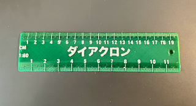
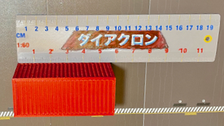

# iRuler customizable ruler
*3D printable customizable ruler in centimeters, inches, or both (formerly thing:1902359)*

### License
[Creative Commons - Attribution - Share Alike](https://creativecommons.org/licenses/by-sa/4.0/)

### Attribution
This is a remix of DrLex' iRuler customizable ruler (github.com/DrLex0/print3d-iRuler), which was remixed from stu121's customizable ruler ([Thingiverse thing:109739](https://www.thingiverse.com/thing:109739)).

### Gallery

[🔎](images/photo1.jpg) [🔎](images/photo2.jpg)

## Description and Instructions

Do you wonder if this box or that styrofoam would make a good terrain piece? Print a free scale in your preferred scale using this parametric scaled rule.  This retains all the functionality of DrLex' iRuler while adding metric scaling as an available unit choice.

* Available in scale meters, centimeters, or inches, or both. (Both allows for inches/cm, scalem/cm, and cm/cm)
* The subdivision lines are recessed, which makes them more printable on an average FDM printer.
* Text and numbers can be embossed or recessed by using a positive, respectively negative height. A height of 0 omits text or numbers. You can even have the text cut all the way through, but this will leave you with loose bits for letters like ‘o’ and ‘B’.
* Optional hole.
* Configurable width.
* Optional rounded corners.
* The design can be flipped around to have the text facing either upward or downward.
* SVG export for laser cutting.  Set both NumberHeight and TextHeight to -2.6 and toggle the SVG Export option.

### Creating a custom ruler

Open the `.scad` file in [OpenSCAD](https://www.openscad.org/) and **[use the OpenSCAD Customizer](https://www.dr-lex.be/3d-printing/customizer.html)** to create a model with your own desired specifications.

If the subdivision lines are set too narrow, they will fuse together and become invisible.

I tried to adjust the subdivisions to make sense at scales, but it doesn't always work.

I have noticed when the scale is below 1:100 and the length is too long it will mark on the halves instead of the units.  I'm still working on that. You can see this effect when uLength is > 25 and < 150. uLength is (the length/(scale in %)) and corresponds to the number of major divisions that need to be subdivided.

Not all Unicode characters may work, although the usual Latin characters like ‘é’ should be directly usable in OpenSCAD without having to use escape codes. Non-European scripts can be usable if you change the font (you will have to do that in the code, there is no customizer option for this).

### Accuracy

If **accuracy** is important, double check the subdivisions with a ruler or calipers. You must consider the fact that most plastics will *shrink* when cooling down after printing. For ABS this can be very significant. To get a perfectly accurate ruler, you should scale up the 3D model in your slicing program or an external 3D model editor, by the inverse of the shrinkage factor.

To determine the shrinkage for your filament and print settings, first print a test piece with the exact same material and settings as you want to use for the ruler. Measure the actual distance between two known points on the printed object. I provide two calibration models that have notches 20 cm or 15 cm apart (7.874 or 5.906 inches). Do not rely on outside dimensions: for the calibration models, measure between the tips of the small triangles, the expected distance is either 200 mm or 150 mm. Calculate the scale factor as the expected length divided by the measured length, and use this factor to scale up the model before printing it.

For instance about 0.5mm shrinkage across 20 cm means you should upscale the ruler to 100.25% to make it accurate.

### Hints for Printing

A layer height of 0.1 is recommended for the details to be well printed. If you can, set perimeter width as narrow as possible (i.e., 0.4 for a 0.4 mm nozzle).
Ironing tends to fill in the subdivisions, so if you choose this option make sure you have that calibrated for your material.

## Updates

### 22JUN2022
First publication on Github & Printables.

## TAGS
'architectural scale', 'engineering scale', 'scale rule', 'measure', `centimeter`, `centimeters`, `customizer`, `imperial`, `inch`, `inches`, `metric`, `millimeter`, `millimeters`, `openscad`, `ruler`, `Ruler_in_Centimeters`, `writescad`
